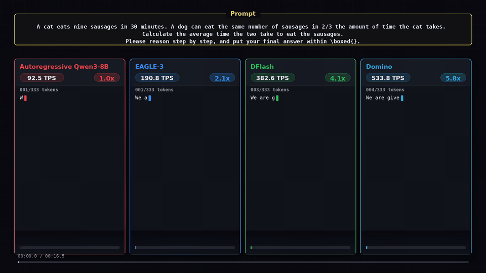

# Domino: Decoupling Causal Modeling from Autoregressive Drafting in Speculative Decoding
<p align="center">
  <a href="https://arxiv.org/abs/2605.29707"></a>
  <a href="https://huggingface.co/collections/Huang2020/domino"></a>
</p>
Domino is a speculative decoding method that keeps draft generation block-parallel while adding a lightweight causal correction head to improve draft-token acceptance.


## News

- [2026-05-30] 🔥🔥 Domino training code is now available in [SpecForge](https://github.com/sgl-project/SpecForge).
- [2026-05-29] 🔥 Domino paper released! Read the paper on [arXiv](https://arxiv.org/abs/2605.29707).

## Demo



## Supported Models

| Target model | Draft model |
| --- | --- |
| `Qwen3-4B` | [`Qwen3-4B-Domino-b16`](https://huggingface.co/Huang2020/Qwen3-4B-Domino-b16) |
| `Qwen3-8B` | [`Qwen3-8B-Domino-b16`](https://huggingface.co/Huang2020/Qwen3-8B-Domino-b16) |
| `Qwen3.6-35B-A3B` | Coming soon |
| `Qwen3.6-27B` | Coming soon |

## Installation

### Ascend MVP

The Ascend MVP targets an eight-card Ascend 910B4 server with CANN 8.0.1. It
uses the eager PyTorch/SDPA path through `torch_npu`; Triton, CUDA Graph,
NPUGraph, FlashAttention, SGLang, and custom AscendC kernels are not part of
this first migration stage.

Create a clean, standalone Conda environment before running or modifying the
Ascend path:

```bash
conda env create -f environment-ascend.yml
source ./activate_ascend.sh
```

`activate_ascend.sh` activates the `domino-ascend` environment, prevents user
site packages and an inherited `PYTHONPATH` from contaminating it, preserves
the standard Hugging Face cache selection, and discovers a configured CANN
installation. Set `DOMINO_CONDA_ENV`, `DOMINO_HF_HOME`, `CANN_ENV_SCRIPT`, or
`CANN_ROOT` before sourcing it when the local installation uses different
paths. The Conda files install Python packages only; CANN and the NPU driver
must be installed by the host administrator.

The Ascend runner defaults to the public `Qwen/Qwen3-8B` and
`Huang2020/Qwen3-8B-Domino-b16` model IDs. Set `TARGET_MODEL` or `DRAFT_MODEL`
to use a local directory. Set the corresponding revision variable to an empty
string when a local directory should not receive a pinned Hub revision:

```bash
TARGET_MODEL=/models/Qwen3-8B TARGET_REVISION= \
DRAFT_MODEL=/models/Qwen3-8B-Domino-b16 DRAFT_REVISION= \
./run_ascend_benchmark.sh
```

Verify the environment before running a model:

```bash
PYTHONPATH= python -m pip check
python - <<'PY'
import torch
import torch_npu

assert torch.npu.is_available()
print("torch:", torch.__version__)
print("torch_npu:", torch_npu.__version__)
print("NPU count:", torch.npu.device_count())
PY
```

For a manual installation instead of the Conda YAML, create Python 3.10 with
pip 25.2, then install `requirements-ascend.txt`. Do not also install
`requirements-hf.txt`, because that file includes the CUDA Triton dependency.

Before the full benchmark, run the short Qwen3-4B block-size sweep:

```bash
./tune_ascend_block_size.sh
```

It tests block sizes `4,8,12,16`, runs one shared target-only baseline, rejects
any candidate whose token IDs differ from the baseline, and writes the fastest
legal choice to `selected_block_size.json`. The short defaults are Alpaca with
4 samples, 128 generated tokens, one warmup, and two timed repetitions. Override
them with environment variables when needed, for example:

```bash
TASKS="gsm8k:8,humaneval:8,alpaca:8" MAX_NEW_TOKENS=256 \
  REPETITIONS=3 NUM_NPUS=1 ./tune_ascend_block_size.sh
```

The full Ascend runner defaults to a FP16 Qwen3-8B target, a BF16 Domino draft,
block size 16, and 8-way NPU data parallelism. FP16 has the same memory
footprint as BF16 but reduces the batch-versus-single-token argmax flips seen
with BF16 block verification. Domino always uses the block-verification result;
there is no sequential replay or low-margin fallback path. Greedy Domino token
IDs can therefore differ from target-only decoding, so use the comparison
summary and task-level quality evaluation together. Qwen3-8B FP32/HF32 does not
fit on one 32 GiB 910B4; Qwen3-4B may still use `TARGET_DTYPE=float32`. The
Python benchmark retains `--target-dtype bfloat16` as its compatibility default.

The tuning sweep preserves manifests, baseline and Domino JSONL files, logs,
comparison summaries, and `run_status.tsv`. The full runner preserves the
manifests, answer JSONL files, and comparison summaries. The full runner defaults
to `ENFORCE=0` so token differences are reported without aborting the remaining
tasks. Set `ENFORCE=1` to require exact token matches and `MIN_SPEEDUP` (1.05 by
default). Run the full Qwen3-8B benchmark with:

```bash
./run_ascend_benchmark.sh
```

### CUDA

Use Python 3.10 or newer on a CUDA GPU machine. Install a PyTorch build that matches your CUDA driver, then install the remaining Hugging Face benchmark dependencies:

```bash
python -m pip install --upgrade pip
python -m pip install -r requirements-hf.txt
```

For the SGLang benchmark, install the extra build tools first. On Ubuntu:

```bash
sudo apt-get update
sudo apt-get install -y build-essential ninja-build protobuf-compiler
```

The SGLang branch also builds a Rust component. Install Rust if `cargo` is not already available:

```bash
curl --proto '=https' --tlsv1.2 -sSf https://sh.rustup.rs | sh -s -- -y
source "$HOME/.cargo/env"
```

Then install the Domino-compatible SGLang branch in the same Python environment:

```bash
git clone --branch sglang-feat/dflash-domino https://github.com/jianuo-huang/Domino.git sglang-domino
cd sglang-domino
python -m pip install -e ./python
python -m pip install --force-reinstall --no-deps sglang-kernel \
  --index-url https://docs.sglang.ai/whl/cu130/
cd -
```

This SGLang branch currently resolves to PyTorch 2.11 CUDA 13 wheels. Use the matching SGLang kernel wheel above, and verify that your NVIDIA driver is new enough for CUDA 13 runtime libraries.

For CUDA 12.8 / PyTorch 2.9, patch the SGLang dependency pins before installing:

```bash
git clone --branch sglang-feat/dflash-domino https://github.com/jianuo-huang/Domino.git sglang-domino
cd sglang-domino

python -m pip install --upgrade pip

sed -i \
  -e 's/"torch==2.11.0"/"torch==2.9.1+cu128"/' \
  -e 's/"torchaudio==2.11.0"/"torchaudio==2.9.1+cu128"/' \
  -e 's/"torchvision"/"torchvision==0.24.1+cu128"/' \
  -e 's/"kernels"/"kernels==0.14.1"/' \
  -e '/"sglang-kernel==0.4.2"/d' \
  python/pyproject.toml

python -m pip install \
  --extra-index-url https://download.pytorch.org/whl/cu128 \
  -e ./python
python -m pip install --force-reinstall --no-deps "${SGLANG_KERNEL_CU12_WHEEL}"
cd -
```

Set `SGLANG_KERNEL_CU12_WHEEL` to a CUDA-12-compatible `sglang-kernel` wheel before running the last command. Do not install the `cu130` wheel in a PyTorch 2.9/cu128 environment.

## Quick Usage

Domino draft checkpoints provide `spec_generate` for direct speculative decoding with a target model. We currently recommend running this path on one GPU.

```python
from transformers import AutoModel, AutoModelForCausalLM, AutoTokenizer

draft_model = AutoModel.from_pretrained(
    "Huang2020/Qwen3-8B-Domino-b16",
    trust_remote_code=True,
    dtype="auto",
    device_map="cuda:0",
).eval()

target_model = AutoModelForCausalLM.from_pretrained(
    "Qwen/Qwen3-8B",
    dtype="auto",
    device_map="cuda:0",
).eval()

tokenizer = AutoTokenizer.from_pretrained("Qwen/Qwen3-8B")
prompt = "How many positive whole-number divisors does 196 have?"
messages = [{"role": "user", "content": prompt}]

# The Domino draft model is trained for Qwen3 with thinking mode disabled.
text = tokenizer.apply_chat_template(
    messages,
    tokenize=False,
    add_generation_prompt=True,
    enable_thinking=False,
)
model_inputs = tokenizer([text], return_tensors="pt").to(draft_model.device)

output_ids = draft_model.spec_generate(
    input_ids=model_inputs["input_ids"],
    target=target_model,
    max_new_tokens=2048,
    temperature=0.0,
    stop_token_ids=[tokenizer.eos_token_id],
)

generated_ids = output_ids[:, model_inputs["input_ids"].shape[1]:]
print(tokenizer.decode(generated_ids[0], skip_special_tokens=True))
```

## Hugging Face Benchmark

```bash
DRAFT_MODEL=Huang2020/Qwen3-8B-Domino-b16 \
TARGET_MODEL=Qwen/Qwen3-8B \
PYTHON=python \
./run_hf_benchmark.sh
```

Defaults:

- `TASKS=gsm8k:128`
- `MAX_NEW_TOKENS=2048`
- `TEMPERATURE=0.0`
- `BLOCK_SIZE=16`
- `NUM_GPUS=8`

Override tasks or runtime settings with environment variables:

```bash
TASKS="gsm8k:128,math500:128" NUM_GPUS=4 ./run_hf_benchmark.sh
```

## SGLang Benchmark

```bash
DRAFT_MODEL=Huang2020/Qwen3-8B-Domino-b16 \
TARGET_MODEL=Qwen/Qwen3-8B \
PYTHON=python \
./run_sglang_benchmark.sh
```

Defaults:

- `TASKS=gsm8k:128`
- `MAX_NEW_TOKENS=2048`
- `TEMPERATURE=0.0`
- `CONCURRENCIES=1,2,4,8,16,32`

Use these sample counts to reproduce the paper settings:

```bash
TASKS="gsm8k:128,math500:128,aime24:30,aime25:30,humaneval:164,mbpp:128,livecodebench:128,swe-bench:128,mt-bench:80,alpaca:128"
```

Override tasks or runtime settings with environment variables:

```bash
TASKS="mt-bench:80,alpaca:128" CONCURRENCIES=1 ./run_sglang_benchmark.sh
```

## Acknowledgements

We thank the authors and maintainers of [DFlash](https://github.com/z-lab/dflash), [SpecForge](https://github.com/sgl-project/SpecForge), [FlashInfer](https://github.com/flashinfer-ai/flashinfer), and [SGLang](https://github.com/sgl-project/sglang). Their open-source work on block-parallel speculative decoding, speculative-decoding training infrastructure, high-performance attention kernels, and LLM serving helped shape this project and its benchmarking setup.

## Citation

If you use Domino in your research, please cite:

```bibtex
@article{huang2026domino,
  title={Domino: Decoupling Causal Modeling from Autoregressive Drafting in Speculative Decoding},
  author={Huang, Jianuo and Zhang, Yaojie and Zhang, Qituan and Lin, Hao and Xu, Hanlin and Zhang, Linfeng},
  journal={arXiv preprint arXiv:2605.29707},
  year={2026}
}
```
